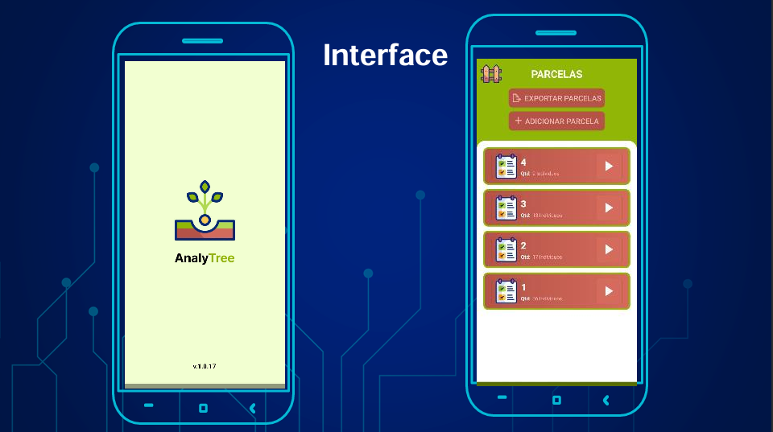
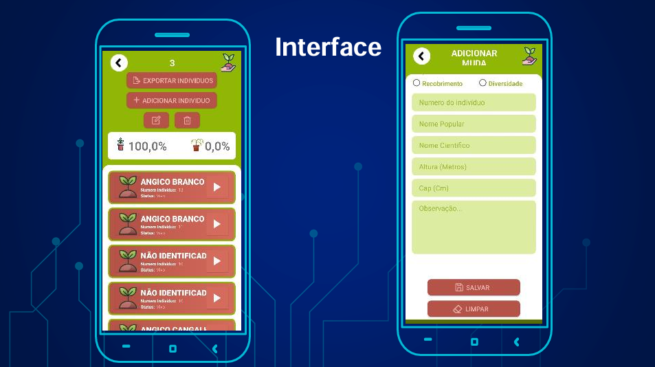

# 🌱 AnalyTree


Aplicativo mobile desenvolvido em **Java** para digitalizar a coleta de dados em atividades de **monitoramento florestal**, substituindo processos baseados em planilhas e permitindo o registro, processamento e exportação das informações diretamente pelo dispositivo móvel.

---

## 📌 Sobre o projeto

O **AnalyTree** surgiu a partir de uma necessidade real de tornar a coleta de dados de monitoramento florestal mais prática, organizada e adequada ao trabalho em campo.

Antes da aplicação, parte do processo dependia do preenchimento e tratamento posterior de planilhas. O aplicativo centraliza a coleta das informações, executa cálculos automaticamente e permite a exportação dos dados para continuidade das análises.

> O objetivo principal é reduzir etapas manuais da coleta e do processamento das informações, mantendo o aplicativo disponível mesmo em locais sem conexão com a internet.

---

## 🎯 Objetivo

Desenvolver uma solução mobile capaz de:

- digitalizar a coleta de dados em campo;
- organizar informações por parcelas e indivíduos;
- automatizar cálculos utilizados no monitoramento;
- reduzir a dependência de planilhas durante a coleta;
- permitir a exportação dos dados;
- funcionar em locais com conectividade limitada ou inexistente.

---

## 💡 Problema resolvido

Em atividades de monitoramento florestal, uma única parcela pode exigir o registro de diversos indivíduos e de diferentes informações para cada planta.

Quando esse processo é realizado utilizando anotações e planilhas, surgem etapas adicionais de:

- transcrição de informações;
- organização dos dados;
- execução manual de cálculos;
- consolidação das análises;
- preparação das informações para compartilhamento.

O **AnalyTree** concentra essas etapas em uma aplicação mobile, permitindo que parte do processamento seja realizada ainda durante a coleta.

---

## ✨ Principais funcionalidades

- 📍 Cadastro de **parcelas de monitoramento**;
- 🌳 Cadastro dos **indivíduos** analisados em cada parcela;
- 📝 Registro das informações coletadas sobre cada planta;
- 🔎 Registro de dados como:
  - espécie;
  - DAP — Diâmetro à Altura do Peito;
  - altura total;
- 🧮 Execução automática de cálculos relacionados ao **volume das árvores**;
- 💾 Armazenamento das informações para utilização durante a coleta;
- 📴 Funcionamento **offline**;
- 📤 Exportação dos dados coletados;
- 📊 Preparação das informações para análise em outras ferramentas.

---

## 🔄 Fluxo de utilização

```text
Cadastro da parcela
        ↓
Cadastro dos indivíduos
        ↓
Coleta dos dados da planta
        ↓
Processamento dos cálculos
        ↓
Armazenamento das informações
        ↓
Consulta dos registros
        ↓
Exportação dos dados
```

### Exemplo de utilização

1. O usuário cadastra uma nova parcela de monitoramento.
2. Dentro da parcela, adiciona os indivíduos que serão analisados.
3. Para cada indivíduo, informa os dados coletados em campo.
4. O aplicativo executa automaticamente os cálculos previstos para a análise.
5. Os registros ficam disponíveis para consulta no próprio dispositivo.
6. Ao final da coleta, os dados podem ser exportados para análise e compartilhamento.

---

## 🧮 Regras de negócio

O AnalyTree não funciona apenas como um formulário de coleta.

A aplicação incorpora regras utilizadas no monitoramento florestal para que parte do processamento das informações seja executada automaticamente.

Entre essas regras está o cálculo de **volume das árvores** a partir dos dados informados durante a coleta.

Com isso, o fluxo deixa de ser:

```text
Coletar dados → Preencher planilha → Executar cálculos → Analisar
```

e passa a ser:

```text
Coletar dados → Aplicativo processa informações → Exportar → Analisar
```

Isso reduz atividades manuais e torna os dados coletados mais organizados para as etapas seguintes do trabalho.

---

## 📴 Funcionamento offline

Um dos requisitos importantes do projeto é a possibilidade de utilização em **áreas remotas**, onde a conexão com a internet pode ser instável ou inexistente.

Por isso, o aplicativo foi projetado para permitir que as atividades essenciais de coleta e consulta sejam realizadas **offline**.

```text
Internet indisponível
        ↓
Coleta continua normalmente
        ↓
Dados permanecem disponíveis no dispositivo
        ↓
Exportação pode ser realizada posteriormente
```

Essa característica torna a aplicação mais adequada ao contexto de trabalho de campo.

---

## 📤 Exportação de dados

Após o processo de coleta, as informações registradas no AnalyTree podem ser exportadas para:

- análise dos dados;
- compartilhamento das informações;
- continuidade do tratamento em outras ferramentas;
- organização dos resultados do monitoramento.

A exportação evita que os dados precisem ser digitados novamente após o trabalho de campo.

---

## 🛠️ Tecnologias

| Tecnologia | Utilização |
|---|---|
| **Java** | Desenvolvimento da aplicação e implementação das regras de negócio |
| **Android** | Plataforma mobile da aplicação |
| **Armazenamento local** | Disponibilidade dos dados durante a operação offline |
| **Exportação de dados** | Disponibilização das informações coletadas para análise externa |

---

## 📱 Interface

O aplicativo possui telas voltadas ao fluxo de coleta em campo, incluindo:

- listagem e cadastro de parcelas;
- listagem dos indivíduos de uma parcela;
- formulário para inserção dos dados das plantas;
- consulta dos registros;
- opção de exportação das informações.

### Screenshots

<p align="center">
  
  
  
</p>


---

## 🌿 Contexto de aplicação

O projeto foi utilizado como solução tecnológica aplicada ao **monitoramento florestal**, aproximando tecnologia, coleta de dados e análise ambiental.

A proposta do aplicativo é permitir que informações relevantes sejam registradas diretamente durante as atividades de campo, deixando os dados mais organizados e acessíveis para análise e tomada de decisão.

---

## 📈 Benefícios da solução

- redução da dependência de planilhas durante a coleta;
- automatização de cálculos;
- menor necessidade de redigitação;
- organização dos dados por parcela e indivíduo;
- possibilidade de utilização em campo sem internet;
- facilidade para exportação e compartilhamento;
- maior agilidade na preparação dos dados para análise.

---

## 🚀 Status do projeto

**Concluído.**

O aplicativo possui o fluxo principal de coleta, cálculos, operação offline e exportação de dados implementado.

---

## 👨‍💻 Autor

**Daybison Braga Batista**

Desenvolvimento da aplicação mobile em **Java**.

[GitHub](https://github.com/daybison-br)

---

## 📄 Observação

O AnalyTree foi desenvolvido com foco em resolver um problema real de coleta e organização de dados em monitoramento florestal. Este repositório tem como objetivo apresentar a implementação e as decisões técnicas adotadas no desenvolvimento da aplicação.
